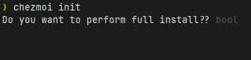

zshrc, .vimrcなどのファイルをgitリポジトリにおいて管理しているが、
今までは[自作のシェルスクリプト](https://github.com/ebiyuu1121/dotfiles/blob/c75a9cb41ef334313c5bdaa6a438badf3db84f23/bin/dotfiles)を置いて管理していた。

dotfilesの管理ツールである[chezmoi](https://www.chezmoi.io/)を導入することにした。
実際に管理しているdotfilesは[ebiyuu1121/dotfiles](https://github.com/ebiyuu1121/dotfiles)に置いてある。

## chezmoiのしくみ

gitリポジトリは `~/.local/share/chezmoi` にcloneされ、スクリプトを実行することでこれをホームディレクトリにコピーする仕組みになっている。

## インストール

chezmoiのインストールはスクリプトが用意されている。ため、これをcurlで持ってきてshに流せばよい。


```sh
sh -c "$(curl -fsLS get.chezmoi.io)"
```

インストール先は `~/bin` となるため、ここにパスを通す必要がある。 `.zshrc` などに以下の記述をする。

```sh
export PATH="$HOME/bin:$PATH"
```

ちなみに、2台目以降にセットアップする場合は、以下のコマンドでインストールからdotfilesのファイルまで一気に行うことができる。

```sh
sh -c "$(curl -fsLS get.chezmoi.io)" -- init --apply $GITHUB_USERNAME
```

ちなみに、homebrewなどの[パッケージマネージャーでインストールすることもできる](https://www.chezmoi.io/install/#one-line-binary-install)が、
以上のワンライナーセットアップが便利なのでこちらを採用した。

ちなみに、上のワンライナーも覚えることができないので、自分のgithubリポジトリに[インストールスクリプト](https://github.com/ebiyuu1121/dotfiles/blob/master/install)を配置しているため、
以下のコマンドで展開まで実行することができる。

```sh
curl -sSL dot.ebiyuu.com | bash
```


## 準備

自分の場合はすでにdotfilesリポジトリがgithubにあったため、以下のコマンドを実行した。

```sh
chezmoi init $GITHUB_USERNAME
chezmoi cd # ~/.local/share/chezmoi に移動
```

今までは手書きのシェルスクリプトで管理していたため、ファイル名は適当だった。

chezmoiではディレクトリ内にあるファイルは全てホームディレクトリに同期されてしまうため、
ファイルを正しい名前にリネームしておく。
(ただし、`.` で始まるファイルは `dot_` にする。 `~/.vimrc` → `~/.local/share/chezmoi/dot_voimrc` )

これで、

```sh
chezmoi apply
```

を実行するとホームディレクトリに配置される。

##  設定

特に設定をしなくても便利に使うことができるが、
auto commitだけ設定している。


以下の設定を `~/.config/chezomoi/chezmoi.toml` に記入する。

```toml
[git]
    autoCommit = true
    autoPush = true
```

ただし、こうなってくると `chezmoi.toml` もchezmoiで管理したくなる。

chezmoi自体の設定ファイルは特殊な方法で管理する。
`~/.local/share/chezmoi/.chezmoi.toml.tmpl` に配置し、 `chezmoi apply` を実行する。

これで、 `chezmoi edit` を実行すると自動的にcommit/pushが行われるため、反映を忘れることがなくなる。
コミットログを綺麗に保ちたいなどの要求がなければ設定しておいてよさそう。

## 普段の運用

chezmoiでホームディレクトリに配置されるのはシンボリックリンクではなく実ファイルであるため、
ホームディレクトリの `.zshrc` を編集してもgitリポジトリには反映されない。

以下のコマンドを用いることで、元ファイルをエディタで編集→反映→コミット(auto commitが有効の場合のみ) を実行できる。

```sh
chezmoi edit ~/.zshrc
```

また、直接 `~/.zshrc` などを編集した場合、以下のコマンドで逆に反映することができる。

```sh
chezmoi add ~/.zshrc
```

以下のコマンドでまとめて反映できる。

```sh
chezmoi re-add
```

一般的には編集して動作確認してからコミットすることが多いと思うので、

編集→動作確認→ `chezmoi re-add` の手順を踏むことが多い。

[テンプレート](https://www.chezmoi.io/user-guide/templating/)などを使う場合はこの運用はできない気がする。テンプレート機能を使い始めたら考える。

## afxのインストール

`chezmoi apply` を実行した際に、 [b4b4r07/afx: 📦 Package manager for CLI](https://github.com/b4b4r07/afx/) をインストールするようにする。
"afx" はcli管理ツールで、現在はneovimをビルドする設定を入れているだけだが、いろいろ設定することができる。

これはchezmoiの[スクリプト機能](https://www.chezmoi.io/user-guide/use-scripts-to-perform-actions/)によって実現することが可能である。
`~/.local/share/chezomi` 以下に追加した、特定の文字列で初まるシェルを、 `chezmoi apply` のタイミングで実行してくれる。

以下の2ファイルを追加する。

`run_once_install_afx.sh` : 一回だけ実行

```sh
#!/bin/bash

set -eu

echo "Installing afx..."
curl -sSL https://raw.githubusercontent.com/b4b4r07/afx/HEAD/hack/install | bash
```

`run_after_afx.sh` : `chezmoi apply` するたびに、「dotfilesの配置が終わったタイミングで」実行

```sh
#!/bin/bash

set -eu

echo "Installing with afx..."

afx install
afx update
afx uninstall
```

これで、dotfilesの配置と同様にソフトのインストールもできるようになった。

### `prompt` の活用

ただ、サーバー等、「dotfilesを配置したいけどneovimなどインストールするまでではない」ということもある。
そこで、 [promptBoolOnce](https://www.chezmoi.io/reference/templates/init-functions/promptBoolOnce/)を活用し、`chezmoi init` した際に選択できるようにした。

`.chezmoi.toml.tmpl` を書きかえる。


```diff-toml
 [git]
     autoCommit = true
     autoPush = true
+[scriptEnv]
+    {{ if promptBoolOnce . "fullInstall" "Do you want to perform full install?" }}CHEZMOI_FULL_INSTALL = "1"{{ end }}
```


これで `chezmoi init` を実行するとプロンプトが表示され、回答が `~/.config/chezmoi/chezmoi.toml` に記入される。



これで、スクリプトの実行時に `CHEZMOI_FULL_INSTALL` がセットされるようになるので、`run_once_install_afx.sh` `run_after_afx.sh` を書き換える。

```diff-sh
 #!/bin/bash
 
 set -eu
 
+if [[ ! -z "${CHEZMOI_FULL_INSTALL:-}" ]]; then
     echo "Installing afx..."
     curl -sSL https://raw.githubusercontent.com/b4b4r07/afx/HEAD/hack/install | bash
+fi
```

```diff-sh
 #!/bin/bash

 set -eu

+if [[ ! -z "${CHEZMOI_FULL_INSTALL:-}" ]]; then
   echo "Installing with afx..."
 
   afx install
   afx update
   afx uninstall
+fi
```

## References

- [chezmoi \- chezmoi](https://www.chezmoi.io/)
- [既存の dotfiles を chezmoi で管理する](https://zenn.dev/johnmanjiro13/articles/d14825f4ef3184)

