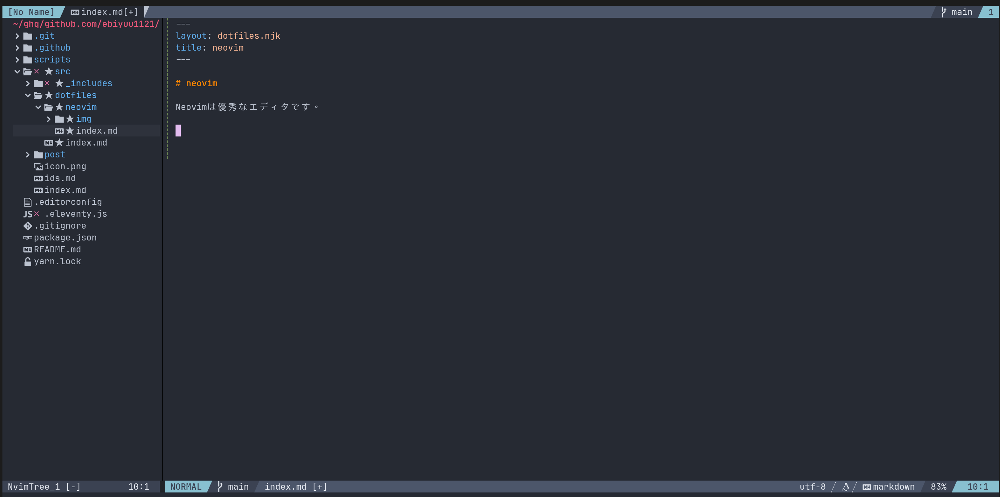

Neovimは優秀なエディタです。



## vim vs neovim

vimでできることは基本的にneovimでもできるので、
neovimを使わない理由はないかなと個人的には思っている。

vi/viはもともとOSに入っていたりするので、vi(m)はnotepad(メモ帳)のような軽量なエディタとして活用しつつ、
プラグインやLSPを入れたりするメインエディタとしてはneovimを使う、という棲み分けをしている。 (2024/2追記)

vimはだいたいのOSにもとから入っているというメリットがあるが、
プラグインが動かなかったりしてどうせ新しいバージョンを入れることになる
(denopsのバージョン要件が結構厳しい)。

ならneovimを入れた方が新しい機能が使えて便利。
あまり詳しくは述べないが、以下のことを利点に思っている。

- カーソルがinsertモードで縦棒になる
- lua製のプラグインも使える
- クリップボード連携がちゃんとしてる(たしかWSLでも動く)

## Neovimのビルド

Neovimは基本的にHEADをビルドして使っている。
nightly版を入れてもいいと

バイナリの管理のためにafx を使っている([参考](/post/2023/05/afx/))が、
バージョンアップの方法が提供されていないので代替手段を見つけてもいいと思っている。

## 設定ファイル

一方でサーバー等の簡単な環境ではvimを使うこともあるため、
必要最低限の設定は `~/.vimrc` に書き、
`~/.config/nvim/init.lua` からsourceしている。

```lua
-- load base vimrc
vim.api.nvim_exec([[source $HOME/.vimrc]], false)
```

