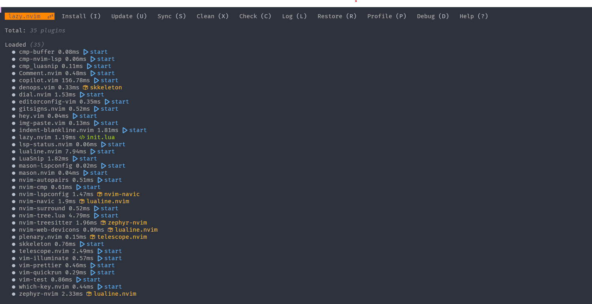
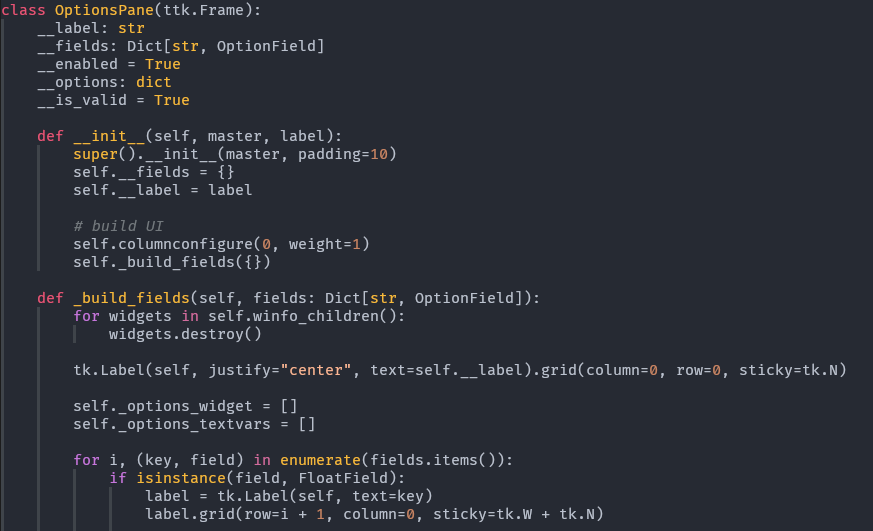
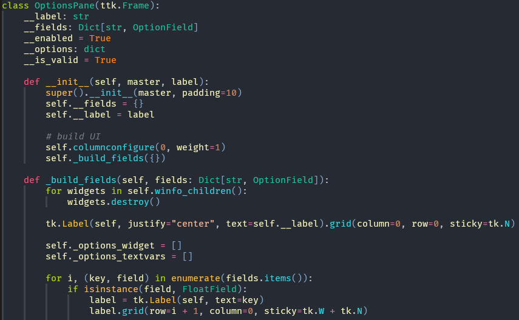
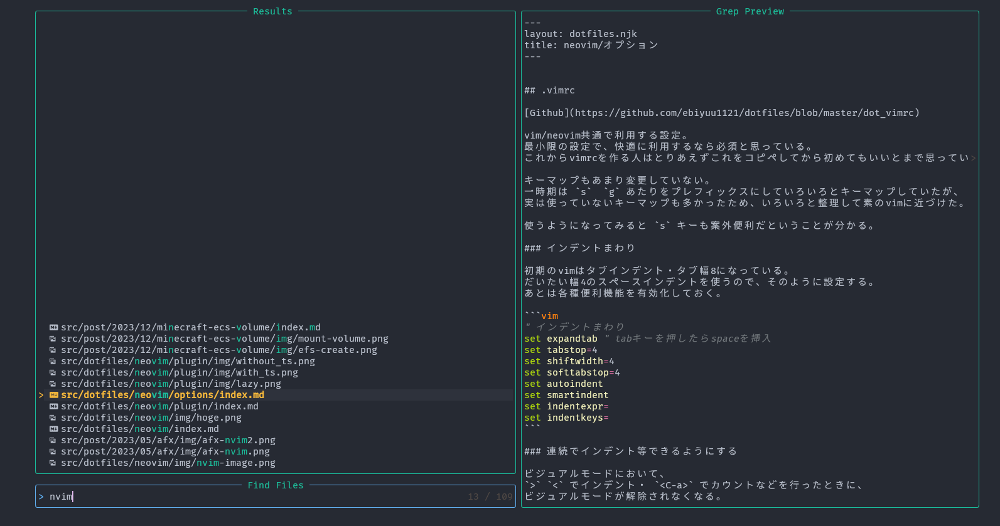

単体で便利なプラグインを紹介。

## プラグインマネージャ: lazy.nvim

lua製では恐らく最も一般的なプラグインマネージャ。
見た目がオシャレで、プラグインのインストール中の進捗が特にオシャレ。



プラグインの設定は
`:Lazy` コマンドでFloatwinを開くことができる。

昔はdeinを使っていたけど、初回起動時の自動インストールまわりの設定が複雑だった。
lazy.nvimは初回起動時の自動インストールを勝手にやってくれるので楽。

## Treesitter

シンタックスハイライトを強化するプラグイン。
Rust製のパーサーであるTreesitterを利用している。

Treesitterなし


Treesitterあり


設定ファイルは以下の通り。
treesitterに対応しているカラースキームをインストールしておく必要がある。

`init.lua`

```lua
require("lazy").setup({
    ...(省略)
    -- colorscheme
    {
        "nvimdev/zephyr-nvim",
        dependencies = { 'nvim-treesitter/nvim-treesitter' },
        config = function()
            require('zephyr')
        end
    },
    {
        "nvim-treesitter/nvim-treesitter",
    }
    ...(省略)
}

require 'nvim-treesitter.configs'.setup {
    highlight = {
        enable = true,
    },
}
...(省略)
```

設定をした後、`:TSInstall` で言語ごとのパーサーをインストールする必要がある。
自動でパーサーをインストールする設定もあるが、
そこそこインストールに時間がかかるのと環境によって使用する言語が異るので、手動でインストールしている。


## VSCode再現系

VSCodeにある便利な機能はneovimにもほしい。

- [lewis6991/gitsigns\.nvim](https://github.com/lewis6991/gitsigns.nvim): gitの差分をバッファの左に表示する。
- [nvim\-telescope/telescope\.nvim](https://github.com/nvim-telescope/telescope.nvim): Ctrl+P に相当するファイル検索
- [nvim\-tree/nvim\-tree\.lua](https://github.com/nvim-tree/nvim-tree.lua): ツリー型ファイラ
- [numToStr/Comment\.nvim](https://github.com/numToStr/Comment.nvim): 簡単にコメントアウト
  - Treesitterの構文解析をベースにしているので、正確なコメントアウトが可能。
- [windwp/nvim\-autopairs](https://github.com/windwp/nvim-autopairs): 括弧の自動補完
- [lukas\-reineke/indent\-blankline\.nvim](https://github.com/lukas-reineke/indent-blankline.nvim): インデントガイド(縦線)を表示
- [github/copilot\.vim](https://github.com/github/copilot.vim): GitHub Copilotの公式プラグイン。node.jsが必要。
- バッファ管理・LSP: これは後述

### Telescope

VSCodeの Ctrl+P と同じ。ディレクトリ内のファイルを検索できる。



`init.lua`

```lua
require("lazy").setup({
    ...(省略)
    {
        'nvim-telescope/telescope.nvim',
        dependencies = { 'nvim-lua/plenary.nvim' },
        config = function()
            require('telescope').setup {
                defaults = {
                    file_ignore_patterns = { ".venv/", ".git/", "node_modules" }
                },
            }
            local builtin = require('telescope.builtin')
            vim.keymap.set('n', '<c-p>', function() builtin.find_files { hidden = true } end, {})
            vim.keymap.set('n', '<c-;>', builtin.keymaps, {})
        end
    },
    ...(省略)
}
```


### nvim-tree

ツリー型ファイラ。
VSCodeのサイドバーに合わせて、Ctrl+B で開けるようにしている。

`init.lua`

```lua
require("lazy").setup({
    ...(省略)
 {
        "nvim-tree/nvim-tree.lua",
        config = function()
            require('nvim-tree').setup {
                actions = {
                    open_file = {
                        quit_on_open = true
                    }
                },
                view = {
                    width = 100,
                },
            }
            vim.keymap.set('n', '<C-b>', '<cmd>NvimTreeFindFile<CR>')
        end
    },
    ...(省略)
}
```

