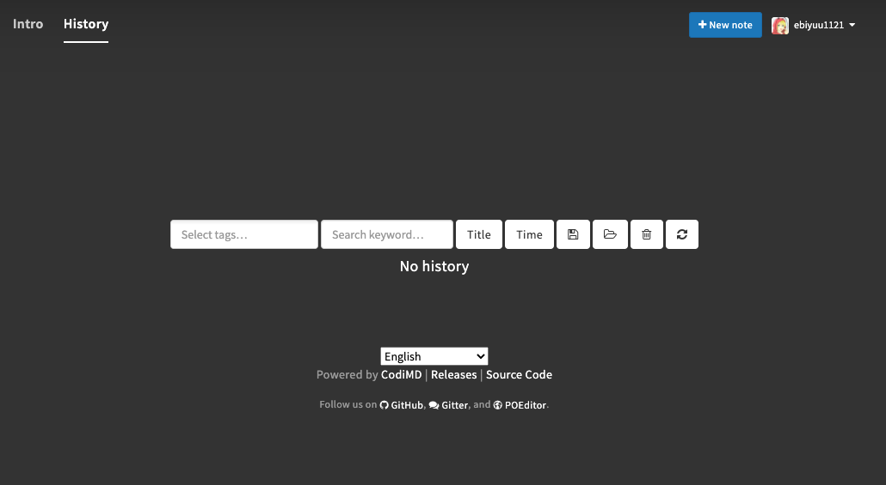
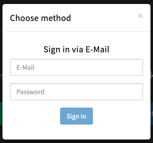

同時編集できるオンラインの Markdown エディタ「HackMD」がある。

[HackMD \- Collaborative Markdown Knowledge Base](https://hackmd.io/)

これのオープンソース版の「CodiMD」を、自分のサーバー上に構築してみた。

## docker の設定

公式サイトを参考にする。

[Docker Deployment \- HackMD](https://hackmd.io/s/codimd-docker-deployment)

新しいフォルダを作り、 `docker-compose.yml` を作成して編集する。
DB のパスワードは `.env` ファイルに書き出す（git にはコミットしない）。

```
.
├─docker-compose.yml
├─.gitignore
└─.env
```

docker-compose.yml

```
version: '3'

services:
    db:
        image: postgres:11.6-alpine
        environment:
            - POSTGRES_USER=${DB_USER}
            - POSTGRES_PASSWORD=${DB_PASSWD}
            - POSTGRES_DB=codimd
        volumes:
            - "db-data:/var/lib/postgresql/data"
        restart: always
    codimd:
        image: nabo.codimd.dev/hackmdio/hackmd:2.2.0
        environment:
            - CMD_DOMAIN=example.com
            - CMD_DB_URL=postgres://${DB_USER}:${DB_PASSWD}@db/codimd
            - CMD_PROTOCOL_USESSL=true
            - CMD_USECDN=false
            - CMD_ALLOW_ANONYMOUS=false
            - CMD_DEFAULT_PERMISSION=private
            - CMD_ALLOW_PDF_EXPORT=true
            - CMD_IMAGE_UPLOAD_TYPE=filesystem
            - CMD_ALLOW_EMAIL_REGISTER=false
        depends_on:
            - db
        ports:
            - "3030:3000"
        volumes:
            - upload-data:/home/hackmd/app/public/uploads
        restart: always
volumes:
    db-data: {}
    upload-data: {}
```

.env（変更する）

```
DB_USRR=codimd DB_PASSWD=somepassword
```

.gitignore

```
.env
```

カスタマイズは環境変数で行っている。

[CodiMD Configuration Overview \- HackMD](https://hackmd.io/c/codimd-documentation/%2Fs%2Fcodimd-configuration)

自分用として使うため、ユーザー登録必須・ユーザー登録はできない設定としている。

## 使ってみる

アクセスしてみる。



ちゃんとユーザー登録ボタンが消えている。



オンラインでのユーザー登録は無効にしているのでコマンドで行う。

```
$ docker-compose exec codimd

# cd bin
# ./manage_users --add user@example.com
# exit
```

うまくログインできた！

## まとめ

- HackMD のオープンソース版「CodiMD」を Docker で構築できた
- 細かく環境変数でカスタマイズできた。

## 参考サイト

- [Docker 内に HackMD 構築してみた話。 – % Incomplete command.](https://hashy0917.wordpress.com/2018/11/14/docker%E5%86%85%E3%81%ABhackmd%E6%A7%8B%E7%AF%89%E3%81%97%E3%81%A6%E3%81%BF%E3%81%9F/)
