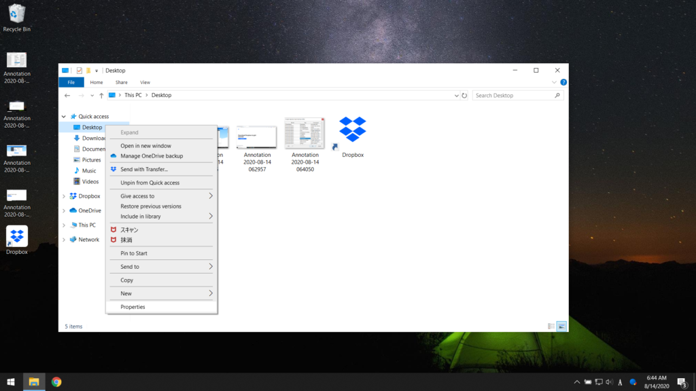
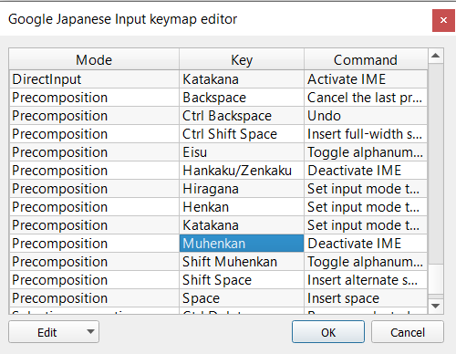

最近 Windows PC の調子が悪くなってきていたので、windows を初期化してインストールし直した。

windows の環境構築のメモ。

## 必須ソフトのインストール

手動で真っ先にインストールするソフト。

### Google Chrome

[Google Chrome \- Download the Fast, Secure Browser from Google](https://www.google.com/chrome/)

ブラウザは普段 Google Chrome を使っている。これをインストールしないと始まらない。

Google Chrome は Google アカウントでログインするだけで設定やブックマークから拡張機能まで、普段の環境が整うのでかんたん。

### 1password

[Best Password Manager for Windows \| 1Password](https://1password.com/downloads/windows/)

パスワード管理は 1password で行っている。これを入れないと各種 web サイトへのログインが面倒なので、まっさきに入れる。

### Dropbox

[ダウンロード \- Dropbox](https://www.dropbox.com/downloading)

ファイルは普段 Dropbox で同期している。これを入れれば普段使っている Office などのファイルが一発で同期されるので、便利。

#### デスクトップの設定

Dropbox をつかって、デスクトップも同期している。（とりあえずデスクトップにおいたファイルが同期されるので便利。）

`Dropbox\Desktop` がデスクトップに表示されるように設定を変える。



エクスプローラーのデスクトップの「プロパティ」の「場所」タブから変更する。

## Google 日本語入力のインストール

Google 日本語入力をインストールする。

また、「変換」「無変換」を用いて入力モードを切りかえる（mac 風）設定にしているので、これを設定しないと使い物にならないので設定する。



Henkan・Hiragana に「Set input mode to Hiragana」、Muhenkan に「Deactivate IME」を選択する。Mode ごとにあるので全部の Mode に関して設定する。

## Scoop のインストール

[Windows の scoop が便利という話](/post/2020/07/scoop/)

前も記事に書いた Scoop を使って各種環境を設定する。

[Scoop](https://scoop.sh/)

Powershell で以下のコマンドを実行してインストールする。

```
Set-ExecutionPolicy RemoteSigned -scope CurrentUser iwr -useb get.scoop.sh | iex
```

ついでに各種基本コマンドをインストールしておく。

```
$ scoop install git $ scoop install make
```

## ssh キーを作る

github に接続するために ssh キーを作って設定する。

```
$ ssh-keygen -b 4096 $ cat ~/.ssh/id_rsa.pub
```

Github に登録しておく。

## dotfiles のインストール

自分で普段使っている`.bashrc`や`.gitconfig`などを入れる。

自作の同期用スクリプトを用意しているので、それを用いる。

今後のシェル操作は git bash からおこなう。

```
$ curl -sL dot.ebiyuu.com | sh $ cd ~/dotfiles $ ./dot link
```

## VSCode の設定

VSCode をインストールする。

```
$ scoop install vscode
```

VSCode を起動したら真っ先に「Setting Sync」拡張機能をインストールして、設定を同期する。

GitHub ログインが終わったら、ctrl+shift+P でコマンドパレットを開き、`> Sync: Download Settings`を選ぶ。

## Docker のインストール

Windows Pro だったので、公式サイトに従ってインストールをしたらすぐ設定が終わった。

## その他

ここまで終わったらほとんど元の環境が整った。あとは LINE や Slack などの細かいソフトを落としたら環境構築完了である。大体 1 時間かからなかった。

## まとめ

- 環境構築をした。
- scoop が便利
- これからも定期的にインストールしなおそう。
