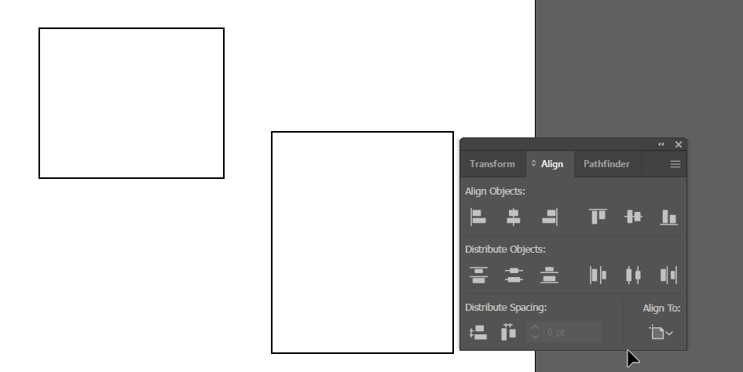

> この記事は [Inkscape の開発に参加した \- Qiita](https://qiita.com/ebiyuu1121/items/991d65f6c975887a7f22) から移行しました。

> この記事は[東京大学工学部電子情報工学科・電気電子工学科](https://www.ee.t.u-tokyo.ac.jp/j/)(通称 eeic, [cf.](https://qiita.com/advent-calendar/2019/eeic))の 3 年後期実験の一つである「[大規模ソフトウェアを手探る](https://doss.eidos.ic.i.u-tokyo.ac.jp/)」のレポートとして，書かれたものです。

## 概要を手探る。

人生で初めて OSS に Contribute したので、そのことについての記録を。
今回は OSS としてドローソフトの Inkscape を取り上げた。
開発は GitLab 上のリポジトリで行われており、メイン言語は C++となっている。

- [Draw Freely \| Inkscape](https://inkscape.org/)
- リポジトリ：[Inkscape / inkscape · GitLab](https://gitlab.com/inkscape/inkscape)

冒頭に書いたとおり、「[大規模ソフトウェアを手探る](https://doss.eidos.ic.i.u-tokyo.ac.jp/)」という大学の授業の一環で行ったことであるが、ずっと OSS に興味はあったので良い機会であった。

今回はバグ修正を１つと、機能追加を１つ行った。
バグ修正の方は Merge Request を提出し、本リポジトリにマージされた。

この記事では、初めて見るソースコードに対して実際にどのように編集を加えていったのかを示す。
※ビルド方法などこの記事に書いていないことについては、同じく実験に参加したメンバーが別途記事を書いている。

- [Inkscape を手探る \- Qiita](https://qiita.com/momoka_0122y/private/df19a0ff5a993514cc89)(目次)
- [Inkscape の環境構築 \- Qiita](https://qiita.com/wolfram1293/private/3c7d88fdd0ba0a6b8111)
- [Visual Studio Code を使ったデバッガ導入とデバッグ実行 \- Qiita](https://qiita.com/wolfram1293/private/cc451b87d74875d6318e)
- [OSS 開発初めかた \(Issue の見つけ方\) \- Qiita](https://qiita.com/momoka_0122y/private/64d35862a357d42c3381)
- [OSS 開発初めかた \(GitLab にある本家にマージ\) \- Qiita](https://qiita.com/momoka_0122y/items/4d04c8f2d94d591f938a)

## バグ修正編

[今回の修正内容](https://gitlab.com/inkscape/inkscape/-/merge_requests/2401/diffs)

### バグの内容を手探る。

今回行った修正は以下の Issue への解決である。

[clipping paths are antialiased even if export is set to no antialiasing \(\#1921\) · Issues · Inkscape / inkscape · GitLab](https://gitlab.com/inkscape/inkscape/-/issues/1921)

要はクリッピングマスクを適用した図形を png エクスポートする際に、アンチエイリアスを無効にする設定にしても反映されないというバグである。

クリッピングマスクを適用した図形を png エクスポートする際に、アンチエイリアスを無効にしてもアンチエイリアスが適用されるバグ。

| アンチエイリアスあり        | アンチエイリアスなし        |
| --------------------------- | --------------------------- |
|  |  |

実際に試してみると、クリッピングパスを設定していないオブジェクト（黒）に関してはアンチエイリアスの設定が反映されているが、クリッピングパスを設定したオブジェクト（赤）に関してはアンチエイリアスの設定に関わらずアンチエイリアス処理が行われていることがわかる。

### 大量のファイルをを手探る。

ファイルが多すぎてどこをどういじれば良いのかわからない。

というわけで手がかりを探そうと思っていたところ、該当 Issue に以下のような記述がなされていた。

> Remarks to whoever wants to try to tackle this : in `src/diplay/drawing-item.cpp` please take the lines 711-726 and make it a static function taking arguments `dc` and `_antialias`, so that you can call it from other places (say, from the `::clip` method, if that has chances to work)

（だいたい意訳）

> この Issue をやる人へ：`src/diplay/drawing-item.cpp` の 711-726 行目を `dc` と `_antialias` を引数にもつ static 関数にすれば、色んな場所から呼び出せます。（そしてこれを `::clip` メソッドから呼び出せばもしかしたらバグの解決に役立つかも！）

このコメント自体がそのまま解決に結びつくかどうかはまだわからないが、 `src/diplay/drawing-item.cpp` を見れば良いということはわかった。というわけで `src/display/drawing-item.cpp` をひもとく。

### `drawing-item.cpp` を手探る。

`drawing-item.cpp` は　`Inkscape::DrawingItem` というクラスの実装が記述されていた。
`DrawingItem` クラスは図形や文字・画像など、描画されるアイテムの基底クラスであるようであり、描画時に用いられる。`DrawingShape` や `DrawingGryphs` などのクラスから継承されていることがわかる。

> 
> （doxygen ドキュメントより）

たくさんのメソッドが記述されていたが、今回関係するメソッドだけを抽出すると以下のようになる。
上で記述されていた 711-726 行目とは、`switch(_antialias){` の行である。

```cpp
...
void
DrawingItem::setAntialiasing(unsigned a)
{
    if (_antialias != a) {
        _antialias = a;
        _markForRendering();
    }
}
...
unsigned
DrawingItem::render(DrawingContext &dc, Geom::IntRect const &area, unsigned flags, DrawingItem *stop_at)
{
    ... // 事前処理など

    switch(_antialias){
        case 0:
            cairo_set_antialias(dc.raw(), CAIRO_ANTIALIAS_NONE);
            break;
        case 1:
            cairo_set_antialias(dc.raw(), CAIRO_ANTIALIAS_FAST);
            break;
        case 2:
            cairo_set_antialias(dc.raw(), CAIRO_ANTIALIAS_GOOD);
            break;
        case 3:
            cairo_set_antialias(dc.raw(), CAIRO_ANTIALIAS_BEST);
            break;
        default: // should not happen
            g_assert_not_reached();
    }

    ... // 描画処理など

    if (_clip) {
        ict.pushGroup();
        _clip->clip(ict, *carea);
        ict.popGroupToSource();
        ict.setOperator(CAIRO_OPERATOR_IN);
        ict.paint();
    }

    ... // 描画処理など
}
...
void
DrawingItem::clip(Inkscape::DrawingContext &dc, Geom::IntRect const &area)
{
    ... // 処理
}
...
```

また、 `Inkscape::DrawingItem` クラスは以下のようなメンバ変数をもつ。（関連するもののみ抽出）

```cpp
DrawingItem *_clip;
unsigned _antialias : 2; ///< antialiasing level (NONE/FAST/GOOD(DEFAULT)/BEST)
```

ソースコードから以下のようなことがわかる

- `render` 関数で描画処理を行っている。
  - 実際にデバッガを用いてブレークポイントを貼りながら実行することで、描画処理時（画面の表示更新時や画像書き出しなどのラスタライズされるタイミング）に `render` メソッドが実行されることがわかった。
- クリッピングパスが設定されたオブジェクトでは `render` メソッド内で　`clip` メソッドが呼び出されている。（デバッガで調べると実際そうであることがわかる）
- `_render` 関数の内部でメンバ変数 `_antialias` の値によって分岐し、アンチエイリアスの設定を切り替えている。
- クリップマスクが設定されている場合、メンバ変数 `_clip` に `DrawingItem` へのポインタが設定されている。（子要素のようなもの）
- 描画ライブラリとして[cairo](https://www.cairographics.org/)が用いられている。

これがわかったところで、まずは、どこで問題が発生しているのかを突き止める。
アンチエイリアスが反映されない原因として、以下のようなものが思いつく。

1. 設定値が　`_antialias` メンバ変数に反映されていない
2. `_antialias` メンバ変数をもとに cairo に設定値を正常に渡せていない
3. cairo が受け取った設定値を反映できていない（ライブラリのバグ）

### `clip()` を手探る。

まず、3 を検証するため、`clip()` メソッドを以下のように変更した。

```diff
  DrawingItem::clip(Inkscape::DrawingContext &dc, Geom::IntRect const &area)
  {
      // don't bother if the object does not implement clipping (e.g. DrawingImage)
      if (!_canClip()) return;
      if (!_visible) return;
      if (!area.intersects(_bbox)) return;


+     cairo_set_antialias(dc.raw(), CAIRO_ANTIALIAS_NONE);
+
      dc.setSource(0,0,0,1);
      dc.pushGroup();

      ...
  }
```

クリッピングマスクに関して、設定値に関わらずアンチエイリアオフに固定してその結果を見る意図である。
これで正常にアンチエイリアスがオフになれば cairo ライブラリには問題がないということが分かる。

実際、ビルドして実行を行ったところ、アンチエイリアスがオフになったため、ライブラリの問題でないことはわかった。

そこで、`render()`メソッドに含まれる`switch`文を`clip()`メソッドにも書いてみる。

```diff
  DrawingItem::clip(Inkscape::DrawingContext &dc, Geom::IntRect const &area)
  {
      // don't bother if the object does not implement clipping (e.g. DrawingImage)
      if (!_canClip()) return;
      if (!_visible) return;
      if (!area.intersects(_bbox)) return;


+     switch(_antialias){
+       case 0:
+           cairo_set_antialias(dc.raw(), CAIRO_ANTIALIAS_NONE);
+           break;
+       case 1:
+           cairo_set_antialias(dc.raw(), CAIRO_ANTIALIAS_FAST);
+           break;
+       case 2:
+           cairo_set_antialias(dc.raw(), CAIRO_ANTIALIAS_GOOD);
+           break;
+       case 3:
+           cairo_set_antialias(dc.raw(), CAIRO_ANTIALIAS_BEST);
+           break;
+       default: // should not happen
+           g_assert_not_reached();
+   }
+
      dc.setSource(0,0,0,1);
      dc.pushGroup();

      ...
  }
```

これでバグ解決となればよかったが、解決しない。
デバッガで見てみると、 `_antialias` の値に設定値が反映されていないことが分かったため、この原因を調査する。

### `_antialias`を手探る。

`_antialias` はアンチエイリアスの設定によって変化するため、全`DrawingItem`で共通である。
（なぜグローバルなオブジェクトではなく各`DrawingItem`に持たせているのかはわからない）

`DrawingItem`(を継承しているクラス)のインスタンスは木構造となっていて、根の`_antialias`を変更して`render()`時に値を子に伝播させていく、という形式のようである。

この伝播の途中で処理が抜けていてクリッピングマスクの部分までで`_antialias`の値が引き継がれていないのが原因のようだった。

`render()`関数内の該当箇所は以下のようになっている。

```cpp
    // 3. Render object itself
    ict.pushGroup();
    render_result = _renderItem(ict, *iarea, flags, stop_at);
```

`_renderItem()`は仮想関数で、実態は`DrawingItem`を継承したクラスで定義されている。
このうち`DrawingGroup::renderItem()`の実装が問題であった。

```diff
  for (auto &i : _children) {
+     i.setAntialiasing(_antialias);
      i.render(dc, area, flags, stop_at);
  }
```

上記のように修正したところ、ちゃんと反映されるようになった。

#### ついでに

`_clip`が指すオブジェクトも`DrawingItem`なので、`_antialias`を持っている。
クリッピングマスクが入れ子になっている場合は、`_clip->_antialias`の値にも反映する必要があるため、`render()`関数の中で更新をおこなう。

```diff
  if (_clip) {
      ict.pushGroup();
+     _clip->setAntialiasing(_antialias); // propagate antialias setting
      _clip->clip(ict, *carea);
      ict.popGroupToSource();
      ict.setOperator(CAIRO_OPERATOR_IN);
      ict.paint();
  }
```

### Merge Request を手探る。

上記の変更を加え、Merge Request を作成した。
Issue でも言及された共通部分の関数化なども合わせて実施した。

[Fix clipping path antialias \(\!2401\) · Merge Requests · Inkscape / inkscape · GitLab](https://gitlab.com/inkscape/inkscape/-/merge_requests/2401)

約 24 時間後に master ブランチへ無事マージされた。

## おまけ：機能追加を手探る。

同じくドローソフトである Adobe Illustrator には、「キーオブジェクトに整列」機能がある。



これを Inkscape で実装した。([変更内容](https://gitlab.com/ebiyuu1121/inkscape/-/compare/2c47cfbda2d5ccbbc4052f77f0bad5837f52bd77...94caf0f50d4461d2eac6a8ba210cb514d5cf7545))


- キーオブジェクトを保持する変数を作成
- 選択ツールの動作を変更
- 整列処理を変更

バグ修正で全体像を掴んでいたこともあり、機能追加自体はかんたんに行うことができた。
まだ未完成の状態で開発を進められていないが、機会があれば追記しようと思う。

## 感想を手探る。

初めての OSS への参加という経験であった。

「大規模ソフトウェアを手探る」というテーマの通り、たくさんのソースコードから該当箇所を見つけ出すのが最も大変であった。しかし、どんなソフトも結局それぞれの機能は普段使うような言語で書かれているということを実感できた。

## 参考

- [Inkscape にナイフ機能を付けてみた 1/4 \- UI をいじる編 \- esudo’s diary](http://esudo.hatenablog.com/entry/2015/11/05/024702)
- [Inkscape を手探る \- くコ:彡](https://ika2018.hatenablog.com/entry/2018/11/05/114408#fn-6316abf8)
- [inkscape で全レイヤー間で同期して動く図形を追加した話 \- dried_doss’s diary](https://dried-doss.hatenablog.com/entry/2019/11/05/000722)
- [team_denki\-kei_inkscape’s diary](http://team-denki-kei-inkscape.hatenablog.com/)
- [Getting Started \| Inkscape](https://inkscape.org/develop/getting-started/)
