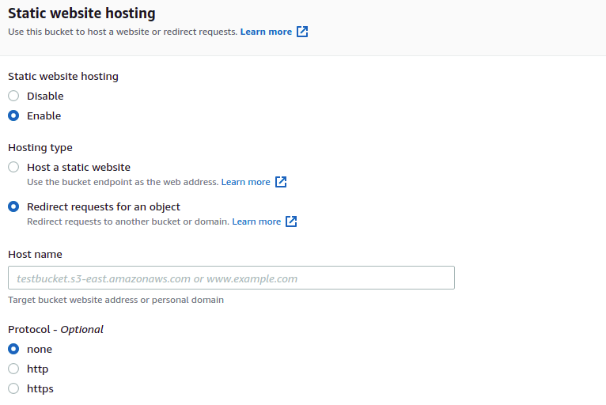

よくアクセスするウェブサイトに簡単にアクセスするため、独自ドメインからリダイレクトを設定したい。

リダイレクトのためだけにサーバーを用意するのも面倒なため、AWSを用いてリダイレクトを行う。

## 構成

S3のStatic Site Hosting機能を使ってリダイレクトを行い、Cloudfront+ACMでSSL化する。SSL化が必要ない場合はS3だけで可能。

### 構築手順

1. S3バケットを設定する。
   独自ドメインのリダイレクトを行う場合、バケット名をドメイン名(FQDN)にしなければならない。
2. Static Site Hostingを有効化し、リダイレクトを設定する。
   
3. Cloudfrontディストリビューションを作成し、Static Site HostingのURL（S3バケットそのものではない）をオリジンに設定する。
4. CloudfrontにCNAMEを設定し、Route 53にてCNAMEレコードを追加してCloudfrontに独自ドメインを設定する。ACMも設定する。

### 302リダイレクト

前述の方法だと、HTTPコードが301になってしまう。リダイレクト先が変更される場合がある場合は302が妥当（ブラウザにリダイレクトがキャッシュされてしまう）。

そこで、`Host Static Website` を選択し、リダイレクトはRedirection Ruleを用いて設定する。

`https://example.com/path` にリダイレクトする場合は以下のようになる。

```json
[
    {
      "Redirect": {
        "HostName": "example.com",
        "HttpRedirectCode": "302",
        "Protocol": "https",
        "ReplaceKeyWith": "path"
      }
    }
]
```


## 参考サイト

- [\(Optional\) Configuring a webpage redirect \- Amazon Simple Storage Service](https://docs.aws.amazon.com/AmazonS3/latest/userguide/how-to-page-redirect.html)

- [S3で302リダイレクトをする（301リダイレクトでなく） \- Make組ブログ](https://blog.hirokiky.org/entry/2018/01/23/174023)
