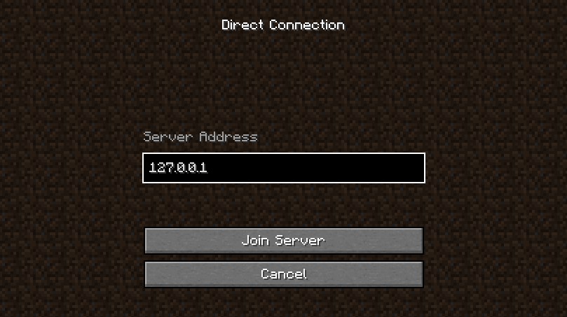
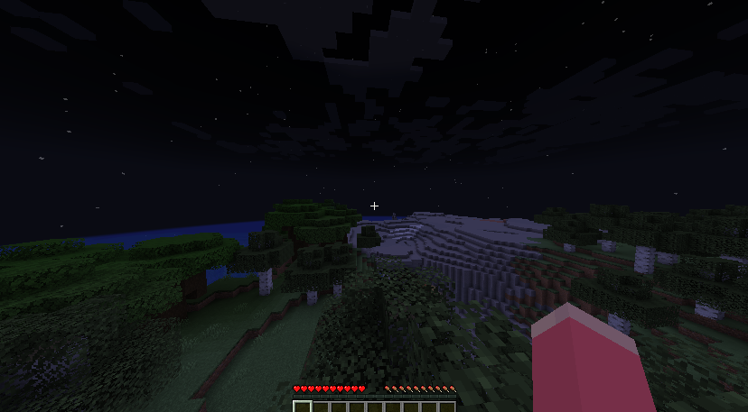

minecraftサーバーをdockerで立ててみる。

[itzg/docker\-minecraft\-server](https://github.com/itzg/docker-minecraft-server) を見つけたので使ってみる。

`docker-compose.yml` を記述する。

```yml
version: "3"

services:
  mc:
    image: itzg/minecraft-server
    ports:
      - 25565:25565
    environment:
      EULA: "TRUE"
      MEMORY: "4G"
    tty: true
    stdin_open: true
    volumes:
      - ./minecraft-data:/data
```

以下を実行したところ、エラーが発生して起動できなかった。

```sh
docker compose up
```

```log
mc-test-mc-1  | [mc-image-helper] 06:24:30.358 ERROR : 'get' command failed. Version is 1.29.0
mc-test-mc-1  | java.net.UnknownHostException: launchermeta.mojang.com: Temporary failure in name resolution
mc-test-mc-1  |         at java.base/java.net.Inet4AddressImpl.lookupAllHostAddr(Native Method)
mc-test-mc-1  |         at java.base/java.net.InetAddress$PlatformNameService.lookupAllHostAddr(Unknown Source)

                  (中略)

mc-test-mc-1  |         at picocli.CommandLine$RunLast.execute(CommandLine.java:2417)
mc-test-mc-1  |         at picocli.CommandLine.execute(CommandLine.java:2170)
mc-test-mc-1  |         at me.itzg.helpers.McImageHelper.main(McImageHelper.java:139)
mc-test-mc-1  | [init] ERROR: version lookup failed:
mc-test-mc-1 exited with code 1
```

DNSが解決できていないようなので、docker-composeでdnsを指定してなんとかする。

```diff-yaml
 version: "3"
 
 services:
   mc:
     image: itzg/minecraft-server
     ports:
       - 25565:25565
     environment:
       EULA: "TRUE"
       MEMORY: "4G"
     tty: true
     stdin_open: true
+    dns: 8.8.8.8
     volumes:
       - ./minecraft-data:/data
```

起動できた。






