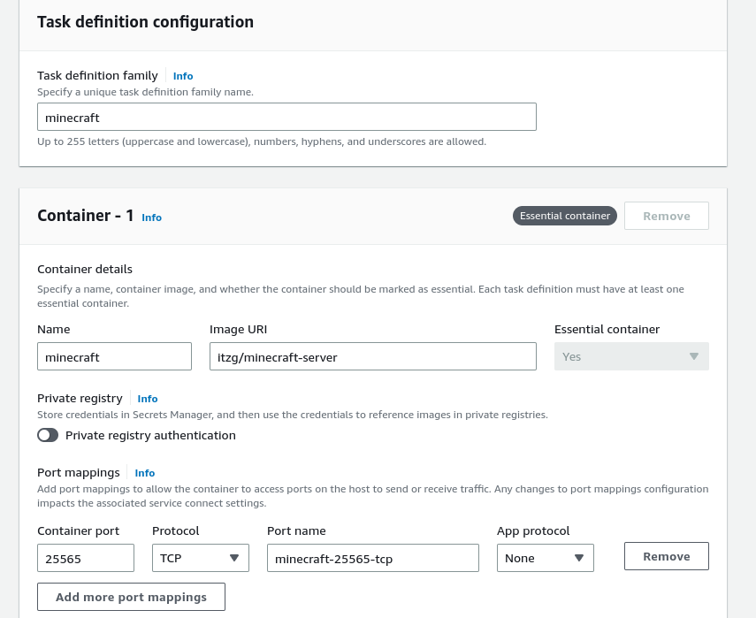
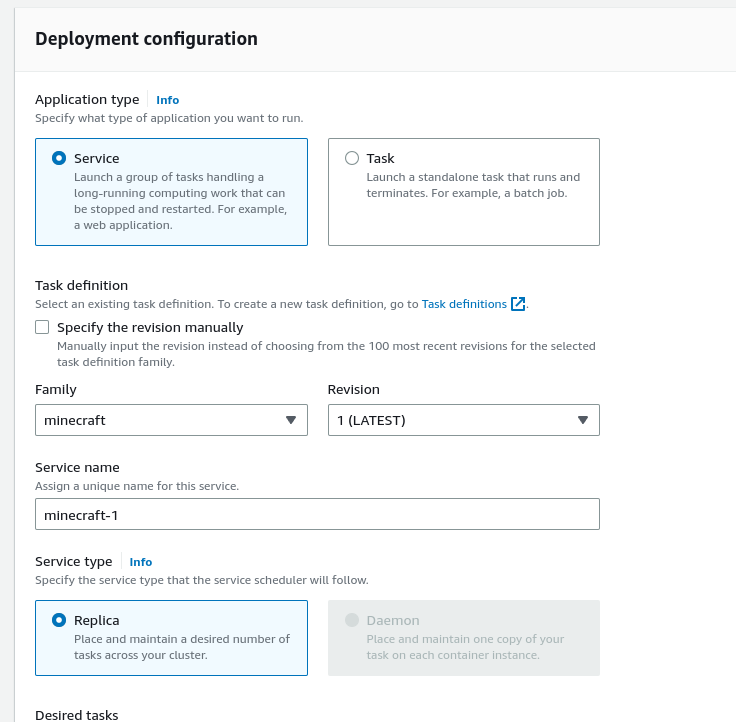
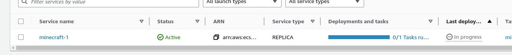
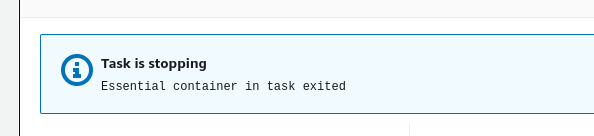
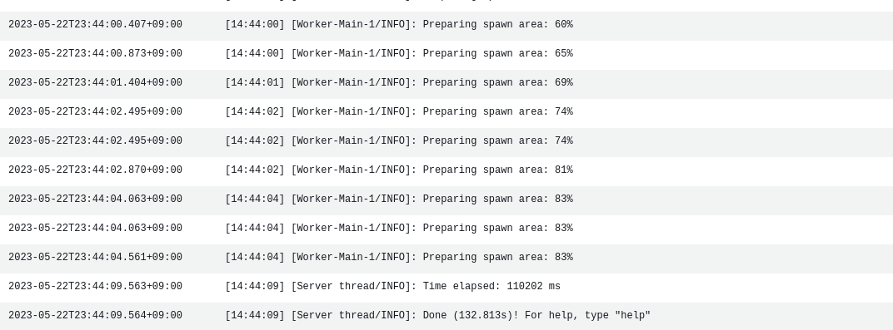
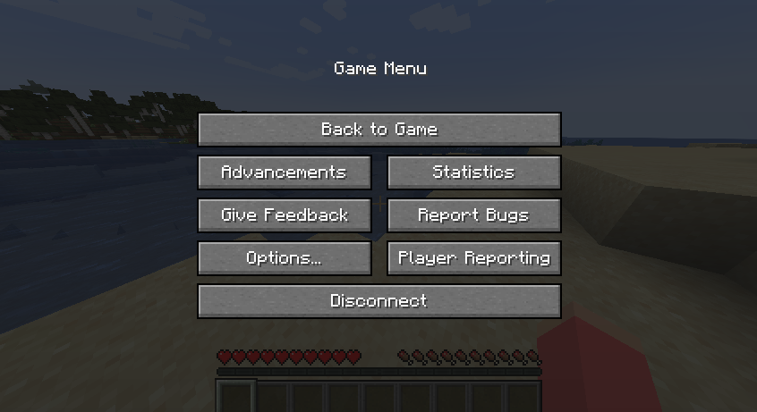

「[Dockerでminecraftを動かしてみる](/post/2023/05/minecraft-docker/)」 の続き。

## 1. クラスターの作成

適当な名前で作成する。

## 2. タスクの作成

[itzg/minecraft\-server \- Docker Image \| Docker Hub](https://hub.docker.com/r/itzg/minecraft-server) を使う。

## 3. デプロイメントの作成

落ちた。

EULAをtrueに設定するのを忘れていたので、
環境変数で `EULA` = `true` を設定して再度試す。

## 4. 起動確認

ログはCloudWatch Logsで確認できる。

起動していた。

接続できた。

ただし、VPCのsecurity groupを編集して `TCP/25565` アクセスを許可する必要がった。
今回はデフォルトVPCを使ったため戻したが、実際は専用のVPCを作った方がよいのかも。

これはちょっと調べる。

## これからやりたいこと

- Volumeを使ってセーブデータを永続化する
- Lambdaを使って起動・終了をする
- Public IPにDNSを割り当てる

## References

- [Amazon ECS コンソールの初回実行ウィザードを利用してコンテナを動かす \- Qiita](https://qiita.com/NaokiIshimura/items/45d2288b5a2fc4e4e4e4#%E3%82%B9%E3%83%86%E3%83%83%E3%83%97-2-docker-%E3%82%A4%E3%83%A1%E3%83%BC%E3%82%B8%E3%81%AE%E6%A7%8B%E7%AF%89%E3%82%BF%E3%82%B0%E4%BB%98%E3%81%91%E3%83%97%E3%83%83%E3%82%B7%E3%83%A5)
- [itzg/docker\-minecraft\-server: Docker image that provides a Minecraft Server that will automatically download selected version at startup](https://github.com/itzg/docker-minecraft-server)
