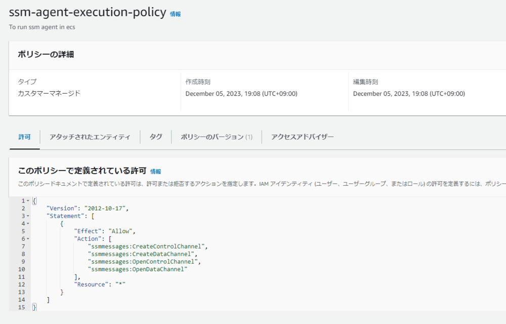

「[ECSでマイクラサーバーを立てる データ永続化編](/post/2023/12/minecraft-ecs-volume/)」のつづき。

op権限を付与するために、コンテナの中でサーバーコマンドを実行したい。

[Sending commands - Minecraft Server on Docker (Java Edition)](https://docker-minecraft-server.readthedocs.io/en/latest/commands/)
を参考にすると、docker execができればよい。今回はECS Execを使ってFaragateコンテナ内で実行する。

## aws cli・session mangager pluginを入れる

aws cliを入れておく。

session manager pluginを入れる

- [AWS CLI 用の Session Manager プラグインをインストールする - AWS Systems Manager](https://docs.aws.amazon.com/ja_jp/systems-manager/latest/userguide/session-manager-working-with-install-plugin.html#install-plugin-verify)

```sh
curl "https://s3.amazonaws.com/session-manager-downloads/plugin/latest/ubuntu_64bit/session-manager-plugin.deb" -o "session-manager-plugin.deb"
sudo dpkg -i session-manager-plugin.deb
```

## ecsにIAMポリシーを付与する。

以下のIAMポリシーを付与したロールを、ECSタスク定義のタスクロールに付与する。

**タスク実行ロール** ではなく **タスクロール** なので注意。

```json
{
  "Version": "2012-10-17",
  "Statement": [
    {
      "Effect": "Allow",
      "Action": [
        "ssmmessages:CreateControlChannel",
        "ssmmessages:CreateDataChannel",
        "ssmmessages:OpenControlChannel",
        "ssmmessages:OpenDataChannel"
      ],
      "Resource": "*"
    }
  ]
}
```

作成したポリシー



作成したロール


ロールをECSのタスク定義に割り当て。


## コマンドを実行する。

```sh
aws ecs execute-command --region ap-northeast-1 --cluster <クラスター名> --task <タスク定義id> --container minecraft --interactive --command rcon-cli
```

→これを実行するとシェルに入ることができる。

## References

- [ECS Execを使って Fargateのコンテナにアクセスする \#AWS - Qiita](https://qiita.com/okubot55/items/b1fb07b2de08c354275b)
- [FARGATEのコンテナにdocker execする【既にECSを使用している方向け】 \#AWS - Qiita](https://qiita.com/ms2geki/items/176bbfd869fe8aba94f4)
- [デバッグ用にAmazon ECS Exec を使用 - Amazon ECS](https://docs.aws.amazon.com/ja_jp/AmazonECS/latest/userguide/ecs-exec.html)
- [Sending commands - Minecraft Server on Docker (Java Edition)](https://docker-minecraft-server.readthedocs.io/en/latest/commands/)
- [RCON - wiki.vg](https://wiki.vg/RCON)
