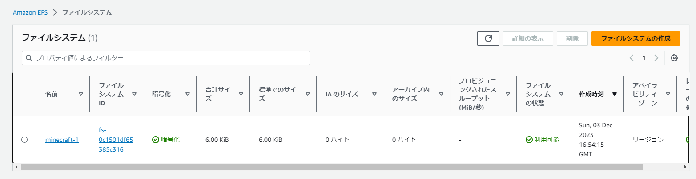
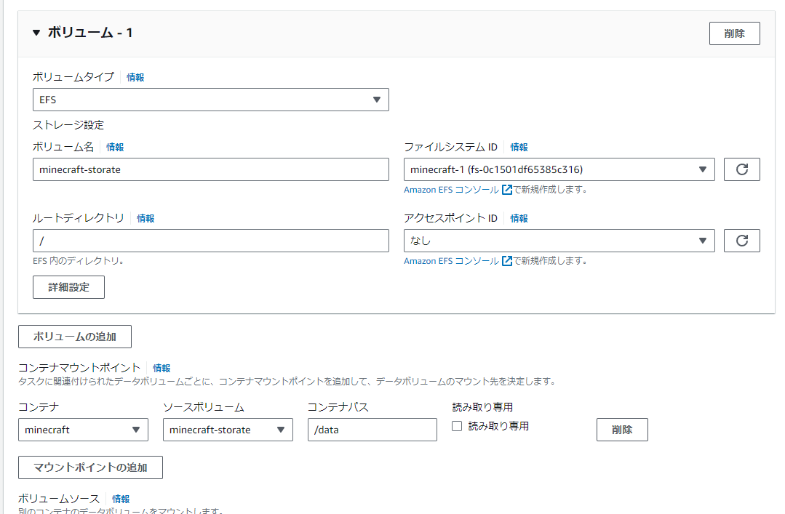

「[ECSでマイクラサーバーを立ててみる。](/post/2023/05/minecraft-ecs/) 」の続き。

今まではコンテナ内部にデータを保持していたため、コンテナを停止するとセーブデータが削除されるようになっていた。

## サービスを起動する

しばらく起動していなかったが、前回のタスク定義が残っていたため、それを利用してサービスを立ち上げるだけ。

## EFSをつくる

EFSを使う。
EFSは(TODO)。

## ボリュームマウントする

- [itzg/docker-minecraft-server の説明](https://docker-minecraft-server.readthedocs.io/en/latest/data-directory/)によると、
コンテナの `/data` にマウントすればよい。

## これからやりたいこと

- サーバーコマンドの実行
- Lambdaを使って起動・終了をする
- Dynamic DNS化

## References

- [Data directory \- Minecraft Server on Docker \(Java Edition\)](https://docker-minecraft-server.readthedocs.io/en/latest/data-directory/)

