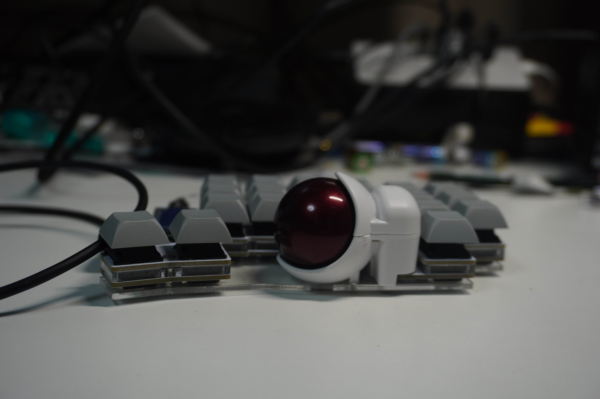
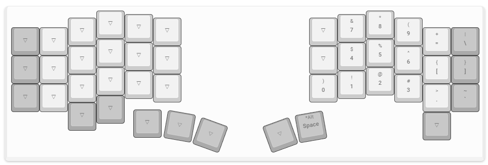
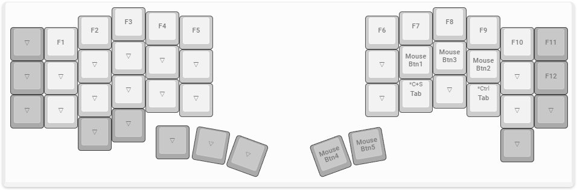
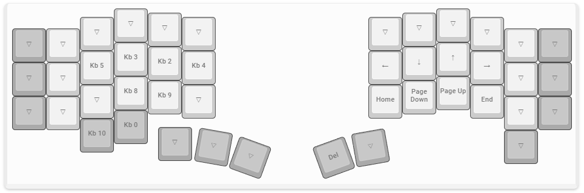

Keyball44を組み立てたので紹介。
実は結構前に組み立てたのだが、記事にしていなかったので書いておく。

## 前回の反省と今回の方針

[Keyball61を組んだ](/post/2023/06/keyball61/)ときの反省を活かす。

- ProMicroのソケットの接触不良があったため、今回はソケットを使わず直接ハンダ付けする。
- 前回は親指ロープロ仕様で組んでいたが、押しづらかったので通常のキースイッチを使う。
- 静音キースイッチを使っていたがせっかくのメカニカルなのでクリック音がする青軸を選択。
    - 自宅で使うので音は気にせず、気持ちよさを優先。

## パーツ

- [Pro Micro Type\-C版](https://shop.yushakobo.jp/products/3905?variant=42888066400487)
    - Type-C版を選択。
- キースイッチ: [Cherry MX Blue](https://shop.yushakobo.jp/products/cherry-mx?variant=44079445541095)
- キーキャップ: [DSA無刻印 鉛](https://shop.yushakobo.jp/products/dsa-blank-keycaps?variant=37665598898337)
    - キー割り当てがどうせ変わるので無刻印を選択。
- [TRSケーブル](https://www.amazon.co.jp/dp/B018FPYC78/)
    - いろいろ試したが、60cm&L字のものが最も快適だった。

## 完成

## キーマップ

結構使って固まったキーマップ。

Remap: [v1.3](https://remap-keys.app/catalog/tAJ9Htme4oNabUkx4832/keymap?id=wD11O9RvG25kK9Xf8Yhq)

### 想定環境
- windows・US キーボード
- CorvusSKKを用いているのでIME切り替えキーは置いていない。

### レイヤ構成

| Layer | Function | Scroll |
| :--- | :--- | :---: |
| L0 | Main Layer | Off |
| L1 | テンキー + 記号 | Off |
| L2 | マウス + ファンクションキー | Off |
| L3 | カーソル + キーボード設定 | On |

### L0

Escは親指の押しやすい場所に置いている（vimを使うため。）

こだわりポイント

- 右にもレイヤ切り替えのキーを用意し、右手だけでマウス操作ができるようにしている

### L1: テンキーLayer

L0に収まらなかった記号キーも置いている。
Shift+数字で入力する記号はこのレイヤ+shift で入力する

### L2: マウスレイヤ

ファンクションキーも置いている。

こだわりポイント

- Ctrl+tabとCtrl+Shift+Tabをマッピングすることで、ブラウザ等でのタブ切り替えを素早く行うことができるようにしている。
- 右親指キーにMouse Button4/5（進む・戻るボタン）を割り当てている。

### L3: カーソルレイヤ

カーソルキーはvimキーバインドと同じになるように hjkl に割り当ててある。
deleteキーもこのレイヤに置いている。
左側にはキーボード設定用のキーも置いている

