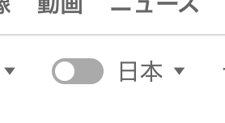
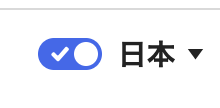
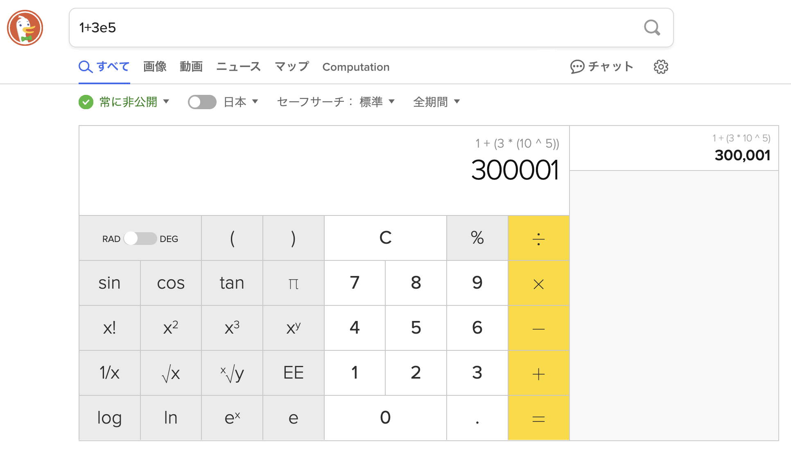
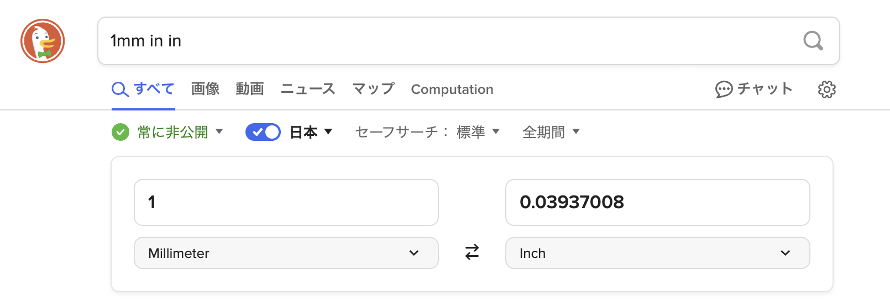
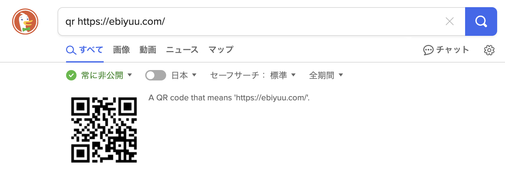
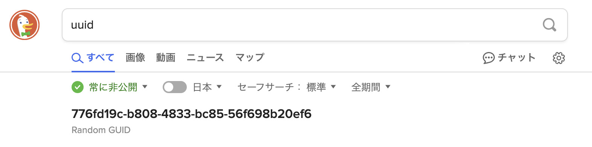
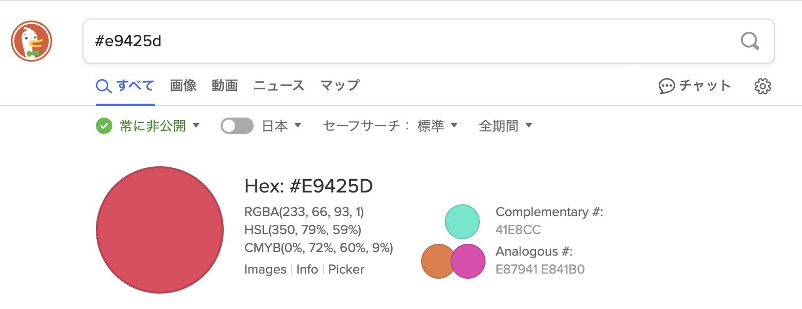
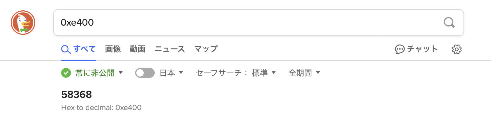
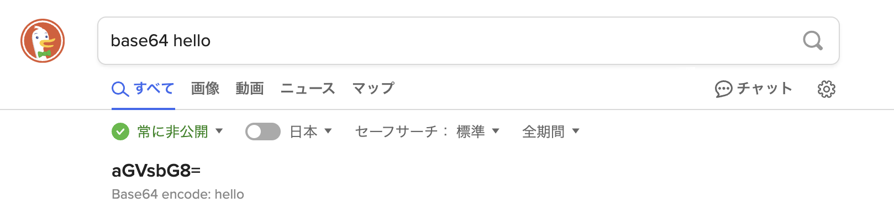
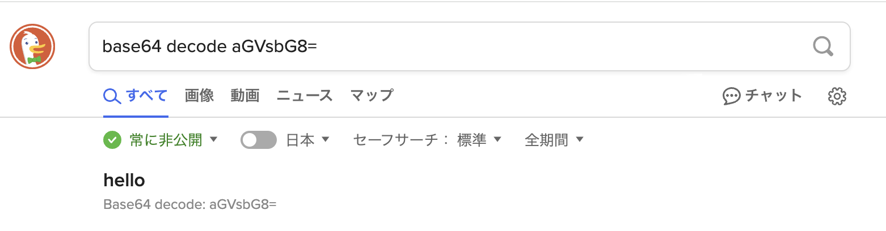

[DuckDuckGo](https://duckduckgo.com/) は、プライバシーを重視した検索エンジンとして知られている。

- トラッキングをしない
- ターゲティング広告なし
- 位置情報を使わない

そのため、最初はプライバシーを重視する人が使う検索エンジンとして認識していたが、
興味本位で使ってみたところ最近は完全に DuckDuckGo を常用するようになってしまった。

DuckDuckGo は単純に検索エンジンとして使い勝手がよく、特にエンジニアが好みそうな機能も多いためである。
この記事ではそれらの機能を紹介する。

仕様頻度順に紹介する。

## ショートカットキー

検索結果画面にショートカットキーが設定されているため、キーボードだけで検索結果の操作ができる。

- `j/↓` `k/↑` で検索結果を選択できる
- `Enter` / `o` / `l`  → 開く
- `v` → 別タブで開く
- `Cmd+Enter` (mac) / `Ctrl+Enter` (win) → 別タブで開く（バックグラウンド）
- `/` で検索バーにフォーカスできる
- `d` 選択したドメインでドメインサーチ
- `t` 最上部へ移動

## 言語での絞り込みが楽

言語設定をしておくと(デフォルトではブラウザの言語が使われる)、検索結果がその言語に合わせて表示される。

言語フィルタのあり・なしをスイッチで簡単に切り替えることができる。

↓

## [神] "Bang" サーチ

検索結果のに `!{keyword}` をつけて検索することで、外部サイトで検索することができる。これが一番便利。

- よく使う例:
  - 「!gmap 渋谷」 → Google Map で「渋谷」と検索
  - 「!a 洗剤」→ Amazon で「洗剤」を検索
  - 「!yt 可愛い猫」 → YouTube で「可愛い猫」を検索
  - 「!w 山手線」 → Wikipediaで 「山手線」を検索
    - ちなみに言語はDuckduckgoの設定に準拠、デフォルトではブラウザの設定言語
  - `!x` → twitter(x)
  - エンジニアにとっても便利。
    - `!py3` → python documentation, `!pip` → pypi, `!docker` → docker hub, `!gh` → github
- 必ずしも先頭である必要はなく、最後でも良いし、なんなら途中でも良い。
- bangの一覧は [DuckDuckGo !Bangs](https://duckduckgo.com/bangs) で参照することができる。

## ツールもいろいろついている

これはGoogleでもある、検索するとそれに応じたツールが表示されるやつ

電卓

単位換算

QRコード生成

UUID生成

カラーコードプレビュー

基数変換

base64 encode/decode

## まとめ

かゆいところに手が届く

## References

- [プライバシー保護とは別視点のDuckDuckGoのすゝめ](https://zenn.dev/hikyae/articles/duckduckgo-other-benefits)
- [How To Use Keyboard Shortcuts on DuckDuckGo Search | DuckDuckGo Help Pages](https://duckduckgo.com/duckduckgo-help-pages/features/keyboard-shortcuts/)
- [技術者にとって代えがたき至高の検索ツールとしての DuckDuckGo: !Bangs のすすめ – yokkin.com](https://yokkin.com/blog/meet-duckduckgo.html#%E3%82%A8%E3%83%B3%E3%82%B8%E3%83%8B%E3%82%A2%E3%81%AB%E3%81%A8%E3%81%A3%E3%81%A6%E3%81%AE!Bangs)
- [DuckDuckGo - The Search Engine for the Developers - DEV Community](https://dev.to/shubhamverma/duckduckgo-the-search-engine-for-the-developers-55a6)

