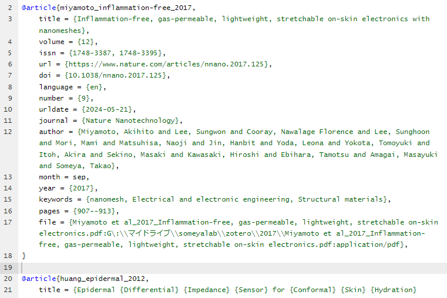

使い方わかってきたなーくらいの人向けのtips

## siunitxを使おう(必須)

単位は斜体にせず、数値と単位の間にスペースを入れるのが一般的。
これを手でやろうとすると面倒だし、ミスのもととなるので、siunitxを使おう。

### 使い方

- プリアンプルに`\usepackage{siunitx}` を書く。
- 例えば、 "1um" と出力したい時は、 `$\SI{1}{\micro\meter}$` と書く。
- 単位だけ出したい場合は小文字の `\si` を使う。 例: `$\si{\micro\meter}$`


## Overleafを使おう(推奨)

- ブラウザさえあればどこでも編集ができる・共同編集ができる
- fast compileを活用すると便利
  - 画像が表示されない代わりにコンパイルが早くなる
- 卒論の時期とか論文の締め切り直前は落ちがちなので定期的にバックアップを取っておく
  - 課金する余裕があればgithub連携がおすすめ（履歴も管理できるしバックアップになる）
  - 余裕があれば手元にもビルド環境を用意しておこう

### 日本語の出し方

日本語を含む文書をタイプセットするために、platexを用いる。
コンパイラは "LaTeX" を選択しておき、 `latexmkrc` を用意しておく。

```text
.
├── main.tex
└── latexmkrc
```

`latexmkrc` には以下の内容を書いておく。

```text
$latex = 'platex';
$bibtex = 'upbibtex';
$dvipdf = 'dvipdfmx %O -o %D %S';
$makeindex = 'mendex -U %O -o %D %S';
$pdf_mode = 3;
```

これで日本語の文書をコンパイルできるようになる。

cf. [【必見】Overleafの使い方（日本語入力も解説・bibファイル）｜努力のガリレオ](https://dreamer-uma.com/overleaf/)

## subfilesを使おう(推奨)

- 論文とかは往々にして長くなりがち→コンパイルにも時間がかかる
- 本文を書く場合、今書いているところだけコンパイルできればよい
- 一方で、全体の配置を見たいので全体でもコンパイルできるようにしたい
- 章ごとにファイルを分割し、 `main.tex` ではそれを import することができる
  - 章のファイルをコンパイルすればその章だけのコンパイルが可能
  - `main.tex` をコンパイルすれば全体の完成系を見ることができる

### 使い方

章ごとのファイルと、 `main.tex` を作成する

```text
.
├── main.tex
└── src
    ├── 1_introductin.tex
    ├── 2_method.tex
    ├── 3_result.tsx
    └── 4_discussion.tex
```

`main.tex` にはこれを書いておく

```tex
% ....
\usepackage{subfiles}

\begin{document}
% ....
\subfile{src/1_introductin.tex}
\subfile{src/2_method.tex}
\subfile{src/3_result.tsx}
\subfile{src/4_discussion.tex}
% ....
\end{document}
```

章ごとのファイルにはこれを書いておく

```tex
\documentclass[../main]{subfiles}
\begin{document}
\end{document}
```
プリアンプルは勝手に `main.tex` のものを引っ張ってきてくれる

## bibtexは文献管理ツールを使おう(推奨)

- bibtexを手書きするのは大変
- だいたいの文献管理ツールはbibtexを書き出すことが可能
- 課金していればmendeley連携も可能
- 例) zoteroからも書き出したもの
  - 
  - bibtexは複数ファイルを使えるので、文献管理ツールで生成するものと自分で管理するもの（ウェブサイト）を分けておくと管理が楽。

## todoマクロを使う(気に入ったら使ってみてね)

自分がやっている内容。

```tex
\usepackage{color}
\newcommand\todo[1]{\PackageWarning{Todo}{Detection TODO:#1}\textcolor{red}{// TODO: #1}}
```

とプリアンプルに書いておいて、

```tex
\todo{ここ後でなおす}
```

のように使う。

このように本文中に表示される。


warningにも表示されるので、コンパイル時に気づきやすい。


## latexdiff(名前だけ覚えておこう)

- texファイルの変更差分を含めた形でpdfにしてくれる
- 論文のrevise時などに便利
- 使い方は省略
  - overleafでも使えるらしい、試したことないけど
    - [How to use latexdiff on Overleaf - Overleaf, Online LaTeX Editor](https://www.overleaf.com/learn/latex/Articles/How_to_use_latexdiff_on_Overleaf)

## References

- [【必見】Overleafの使い方（日本語入力も解説・bibファイル）｜努力のガリレオ](https://dreamer-uma.com/overleaf/)
- [How to use latexdiff on Overleaf - Overleaf, Online LaTeX Editor](https://www.overleaf.com/learn/latex/Articles/How_to_use_latexdiff_on_Overleaf)

